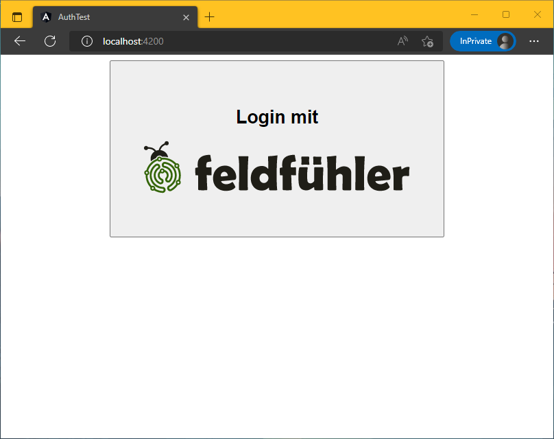
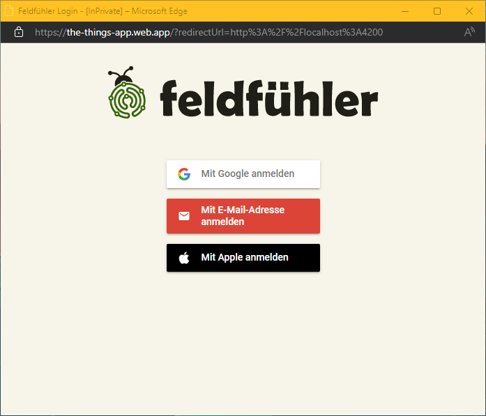

# Feldfühler Login Example

Diese Angular 14 App soll den Login für feldfühler.app demonstrieren.
- Beim Klick auf den Button öffnet sich das Popup vom Feldfühler Login.
- Hat sich der Nutzer erfolgreich angemeldet oder registriert, wird jeweils ein OAuth AccessToken und ein RefreshToken an die App übermittelt und das Popup geschlossen.






[src/app/auth.service.ts](src/app/auth.service.ts)
```ts
import { Injectable } from '@angular/core';
import { Subject } from 'rxjs';

@Injectable({
  providedIn: 'root',
})
export class AuthService {
  public readonly authData$ = new Subject<any>();

  // URL der Feldfühler Login Seite
  private readonly loginUrl = 'https://the-things-app.web.app';

  constructor() {
    // EventHandler registrieren um die Antwort vom PopUp zu bekommen
    window.addEventListener('message', (event) => {

      // nur auf Event vom PopUp reagieren
      if (event.origin !== this.loginUrl) {
        return;
      }

      this.authData$.next(event.data);
    });
  }

  login() {
    // Die URL dieser App, an diese sendet das PopUp dann die Antwort
    const encodedRedirectUrl = encodeURIComponent(window.origin);

    // Öffnet neues PopUp und lädt die Feldfühler Login Seite
    open(
      `${this.loginUrl}?redirectUrl=${encodedRedirectUrl}`,
      'Feldfühler - Login',
      'width=985,height=735'
    );
  }
}

```

This project was generated with [Angular CLI](https://github.com/angular/angular-cli) version 14.1.0.

## Development server

Run `ng serve` for a dev server. Navigate to `http://localhost:4200/`. The application will automatically reload if you change any of the source files.

## Code scaffolding

Run `ng generate component component-name` to generate a new component. You can also use `ng generate directive|pipe|service|class|guard|interface|enum|module`.

## Build

Run `ng build` to build the project. The build artifacts will be stored in the `dist/` directory.

## Running unit tests

Run `ng test` to execute the unit tests via [Karma](https://karma-runner.github.io).

## Running end-to-end tests

Run `ng e2e` to execute the end-to-end tests via a platform of your choice. To use this command, you need to first add a package that implements end-to-end testing capabilities.

## Further help

To get more help on the Angular CLI use `ng help` or go check out the [Angular CLI Overview and Command Reference](https://angular.io/cli) page.
